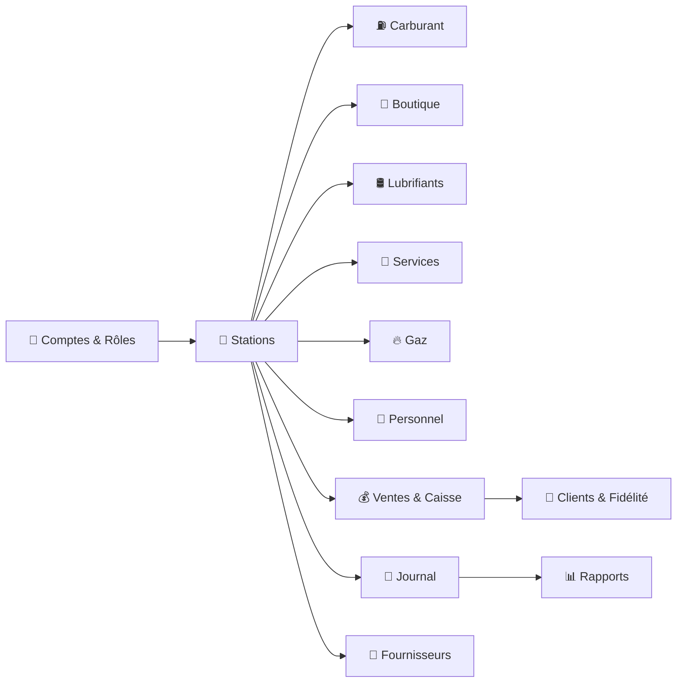
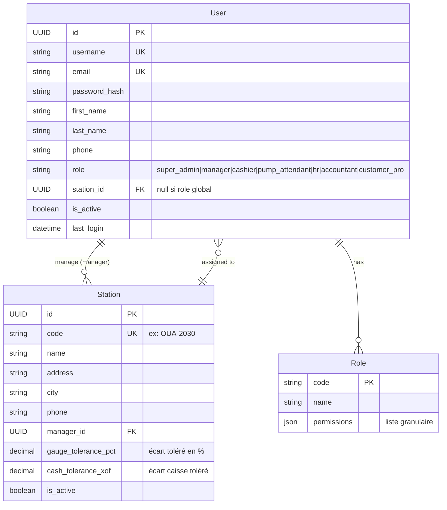
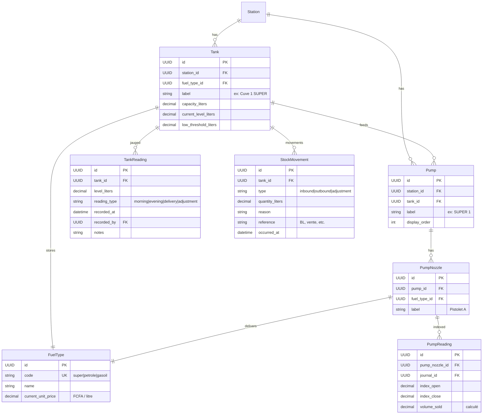
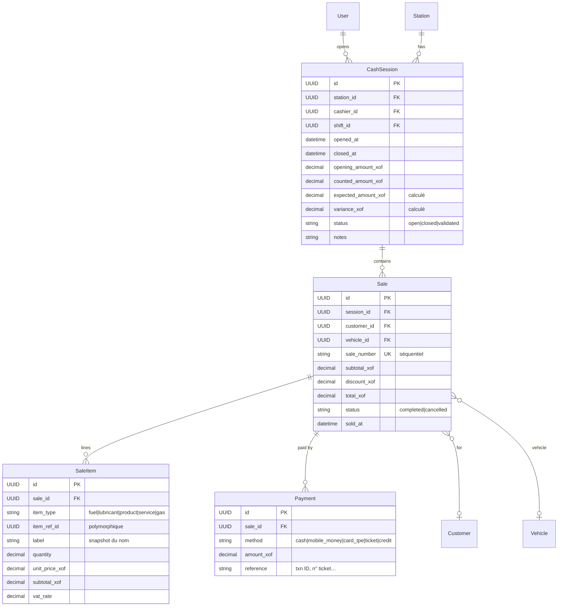
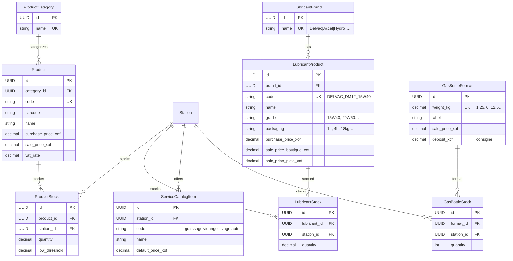
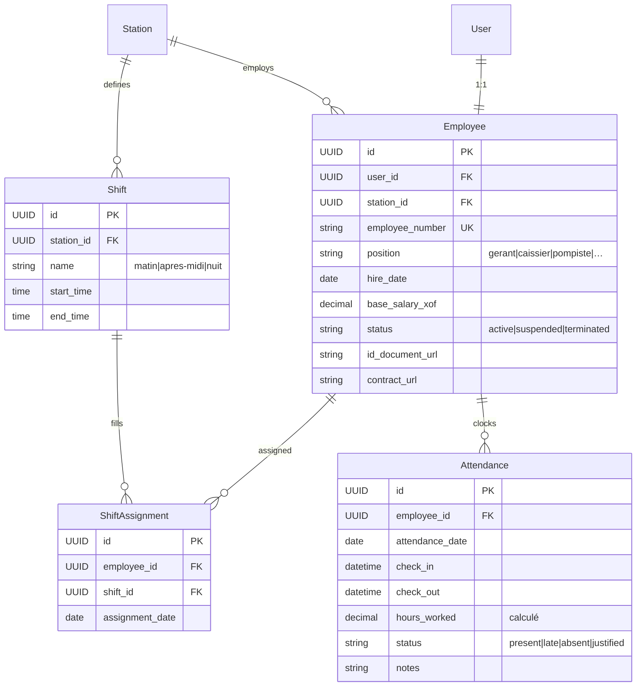
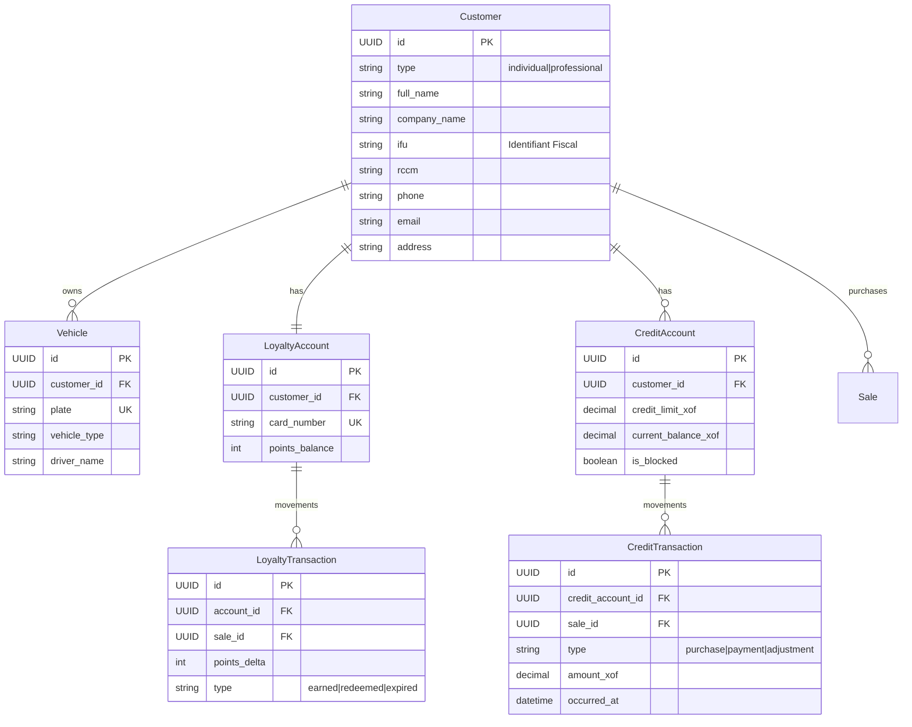
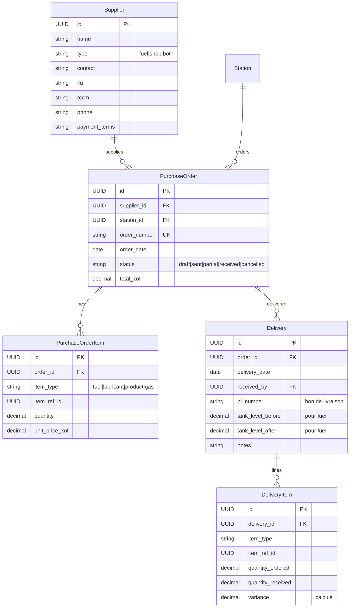
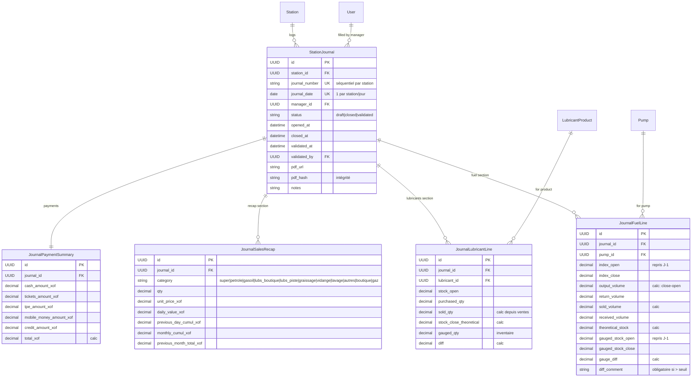
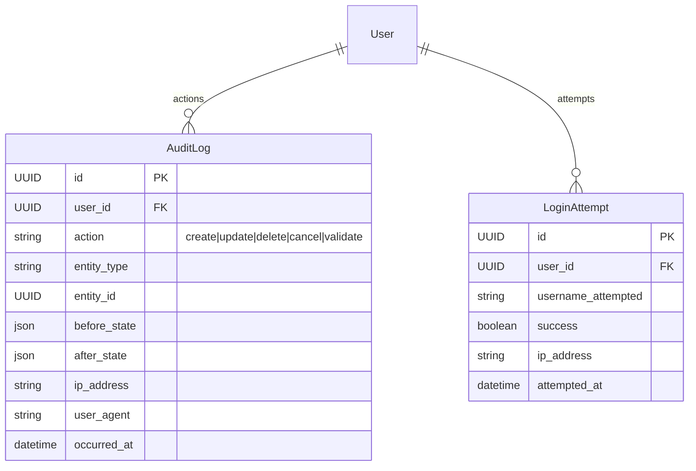

# Schéma de base de données

**Document complémentaire au :** `CAHIER_DES_CHARGES.md` et `ANNEXE_A_JOURNAL_STATION.md`
**Format :** diagrammes Mermaid (rendus nativement dans VSCode et GitHub).

> **Convention commune :** chaque entité hérite implicitement de `BaseModel` (id UUID, created_at, updated_at, created_by, is_active). Ces champs ne sont pas répétés dans les diagrammes pour la lisibilité.

---

## 1. Vue d'ensemble (par domaine)



---

## 2. Domaine — Comptes & Stations



---

## 3. Domaine — Carburant



---

## 4. Domaine — Ventes & Caisse



---

## 5. Domaine — Boutique, Lubrifiants, Services, Gaz



---

## 6. Domaine — Personnel



---

## 7. Domaine — Clients & Fidélité



---

## 8. Domaine — Fournisseurs & Approvisionnement



---

## 9. Domaine — Journal de Station (cœur métier)



---

## 10. Domaine — Audit & Sécurité (transverse)



---

## 11. Index recommandés (PostgreSQL)

Pour garantir la performance, créer ces index dès les premières migrations :

```sql
-- Filtre station partout
CREATE INDEX idx_user_station ON accounts_user(station_id) WHERE is_active = true;
CREATE INDEX idx_sale_station_date ON sales_sale(session_id, sold_at);
CREATE INDEX idx_journal_station_date ON journal_stationjournal(station_id, journal_date);

-- Recherches fréquentes
CREATE INDEX idx_customer_phone ON customers_customer(phone);
CREATE INDEX idx_vehicle_plate ON customers_vehicle(plate);
CREATE INDEX idx_product_barcode ON shop_product(barcode);

-- Audit log (lectures par entité)
CREATE INDEX idx_audit_entity ON core_auditlog(entity_type, entity_id);
CREATE INDEX idx_audit_user_date ON core_auditlog(user_id, occurred_at DESC);

-- Contraintes d'unicité métier
CREATE UNIQUE INDEX uniq_journal_per_station_per_day
    ON journal_stationjournal(station_id, journal_date);
CREATE UNIQUE INDEX uniq_open_session_per_cashier
    ON sales_cashsession(cashier_id) WHERE status = 'open';
```

---

## 12. Règles d'intégrité critiques

À implémenter en contraintes BDD ou en validation Django :

1. **Un seul journal "draft" par station à un instant T.**
2. **Une seule session de caisse "open" par caissier à un instant T.**
3. **L'index de fermeture d'une pompe ≥ index d'ouverture.**
4. **Total des paiements d'une vente = total de la vente** (tolérance 1 FCFA pour arrondi).
5. **Stock d'un produit / lubrifiant ≥ 0** après chaque mouvement.
6. **Vente à crédit → solde après vente ≤ plafond crédit.**
7. **Une vente ne peut être enregistrée que sur une session de caisse "open".**
8. **Un journal ne peut être clôturé que si toutes les lignes pompes ont un index de fermeture.**
